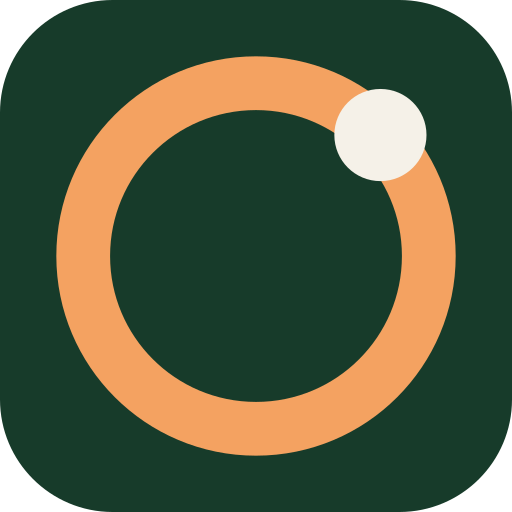
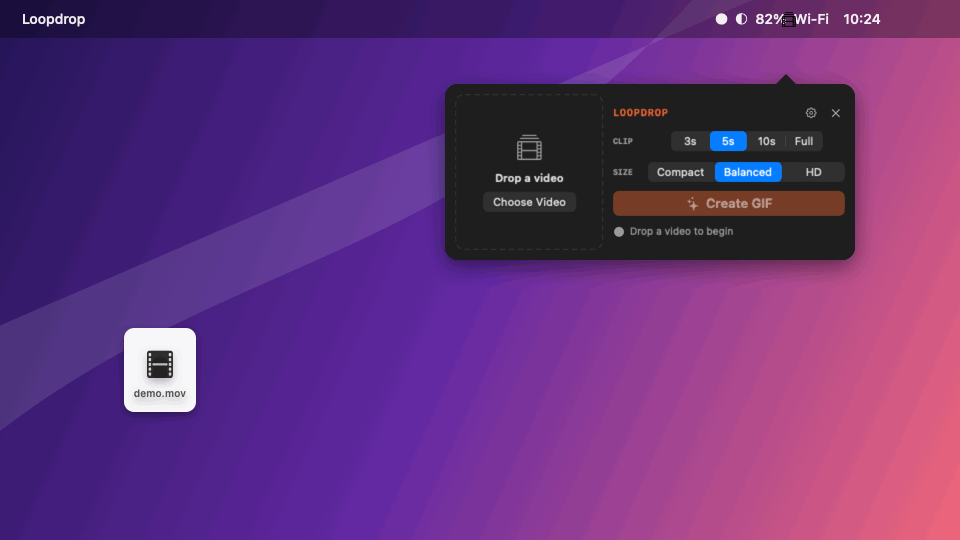

<p align="center">
  
</p>

<h1 align="center">Loopdrop</h1>

<p align="center">
  <strong>Drop a video. Get a GIF.</strong><br>
  A tiny, private, native macOS menu-bar app.
</p>

<p align="center">
  <a href="https://github.com/ibaiGorordo/loopdrop/actions/workflows/ci.yml"></a>
  <a href="LICENSE"></a>
  
</p>

Loopdrop converts videos entirely on your Mac with AVFoundation, Core Image,
and ImageIO. The universal app is about 2 MB and contains no Electron, FFmpeg,
JavaScript runtime, telemetry SDK, or third-party package.



## Install

Download `loopdrop-<version>-mac-universal.dmg` from the
[latest GitHub release](https://github.com/ibaiGorordo/loopdrop/releases/latest),
open it, and drag **Loopdrop** to Applications. The official build supports
macOS 13 or later on Apple silicon and Intel Macs and is Developer ID signed
and notarized by Apple.

Version 0.2.0 is a native macOS replacement for the earlier cross-platform
prototype. The archived [v0.1.0 release](https://github.com/ibaiGorordo/loopdrop/releases/tag/v0.1.0)
remains available for existing Linux users, but it is no longer supported.

## Use

1. Click the Loopdrop icon in the menu bar.
2. Drop a video onto the compact converter, or choose one in Finder.
3. Pick a clip length and quality preset.
4. Click **Create GIF**.

The GIF is written automatically to Downloads and revealed in Finder. Use the
`×` beside the filename to clear the current video. Closing the popover does
not stop a conversion.

The compact interface includes:

- 3, 5, and 10 second clips, plus the full video;
- Compact, Balanced, and HD quality presets;
- a bounded, muted video preview;
- progress and cancellation;
- collision-safe output names and atomic finalization; and
- saved defaults for clip length, quality, preview playback, and Finder reveal.

Open settings from the gear button or by right-clicking the menu-bar icon.
The same menu provides **Check for Updates…** and **Quit Loopdrop**.

## Native conversion

Loopdrop decodes sequentially with `AVAssetReader`, applies the source
orientation and scaling through Core Image, and streams frames into an ImageIO
GIF destination. It retains only a constant number of frames instead of
buffering the video and caps a conversion at 300 output frames. Full-video
exports preserve duration by reducing the effective frame rate when necessary.

Output is written to a unique temporary file beside its destination and moved
into place with an atomic, no-replace operation. A file created by another
process during conversion is never overwritten or deleted. Handled failures,
cancellation, and normal quit clean up Loopdrop-owned temporary files.

Because the app deliberately does not bundle a codec library, input support is
limited to containers and codecs that macOS AVFoundation can decode. Common
MOV, MP4, and M4V files using Apple-supported codecs work; formats such as MKV,
WebM, or legacy codecs may not.

## Privacy and updates

Video probing, decoding, resizing, and GIF encoding happen locally. Source
videos and generated GIFs are never uploaded.

Loopdrop makes a small HTTPS request to GitHub's public Releases API at startup
and every six hours to check the latest version. It sends no video data or
identifier. Manual checks report current, available, and offline states. When
an update exists, Loopdrop opens the signed release page for installation; it
does not download or replace itself silently.

## Build from source

Requirements:

- macOS 13 or later;
- Apple Command Line Tools for building; and
- full Xcode for the XCTest suite.

Build a host-architecture development executable:

```bash
swift build
```

Build the universal arm64 + x86_64 app, validate both deployment targets, copy
the project license, and apply a local ad-hoc signature:

```bash
./scripts/build-app.sh
open ".build/app/loopdrop.app"
```

Run all tests with the installed Xcode toolchain:

```bash
DEVELOPER_DIR=/Applications/Xcode.app/Contents/Developer \
  xcrun swift test
```

The package has no external dependencies. Confirm that directly with:

```bash
swift package show-dependencies
```

Official artifacts are produced only by the protected tag workflow. A local
ad-hoc build is not suitable for redistribution. See
[Releasing Loopdrop](docs/RELEASING.md) for signing, notarization, and release
verification.

## Contributing and security

Focused issues and pull requests are welcome. Read
[CONTRIBUTING.md](CONTRIBUTING.md) before submitting code. Report suspected
vulnerabilities privately through the process in [SECURITY.md](SECURITY.md).

Loopdrop is available under the [MIT License](LICENSE).
