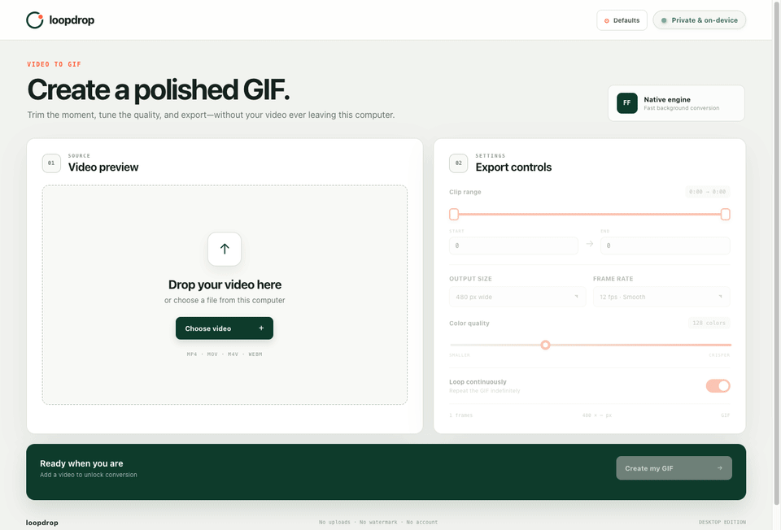
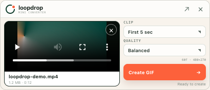

<p align="center">
  
</p>

<h1 align="center">Loopdrop</h1>

<p align="center">
  <strong>Turn local video clips into polished GIFs.</strong><br>
  Use the desktop editor, compact menu-bar converter, CLI, or MCP server.
</p>

<p align="center">
  <a href="https://github.com/ibaiGorordo/loopdrop/actions/workflows/ci.yml"></a>
  <a href="LICENSE"></a>
  
</p>

All media processing runs on the same computer through FFmpeg. Source videos
and generated GIFs are never uploaded.

> **Release status:** Loopdrop 0.1.0 is under active development. There is no
> public installer release or published npm package yet. The source can be run
> and packaged locally, but current development builds are not a substitute for
> the signed, notarized, clean-machine-tested release described in
> [Releasing Loopdrop](docs/RELEASING.md).



## Install

The first signed public release is being prepared. There is currently no
official installer download. When it is published, installers will be
available only from [GitHub Releases](https://github.com/ibaiGorordo/loopdrop/releases).
You can [run Loopdrop from source](#running-from-source) today.

After the first release is published, choose the installer for your computer:

| Platform | Download | Install |
| --- | --- | --- |
| macOS 13+ (Apple silicon or Intel) | `loopdrop-<version>-mac-universal.dmg` | Open the DMG, drag Loopdrop to Applications, then open it normally. |
| Windows x64 | `loopdrop-<version>-win-x64.exe` | Run the signed installer, then launch Loopdrop from the Start menu or desktop shortcut. |
| Debian or Ubuntu (x64) | `loopdrop-<version>-linux-amd64.deb` | Run `sudo apt install ./loopdrop-<version>-linux-amd64.deb`. |
| Debian or Ubuntu (arm64) | `loopdrop-<version>-linux-arm64.deb` | Run `sudo apt install ./loopdrop-<version>-linux-arm64.deb`. |
| Other Linux (x64 or arm64) | Matching `.AppImage` | Make it executable with `chmod +x <file>.AppImage`, then open it. |

Download Loopdrop only from this repository. Signed macOS and Windows builds
check GitHub for updates; Linux builds link back to the Releases page.

## What it includes

- A full desktop editor for previewing a video, trimming a range, choosing the
  output size, frame rate, palette size, and loop behavior.
- A 410 × 176 mini converter in the macOS menu bar or Windows/Linux system
  tray. Drop or choose a video, select a clip length and quality preset, then
  create the GIF without opening the full editor.
- Native, multithreaded FFmpeg conversion that continues while the app is
  behind another window or the full editor is closed.
- Automatic desktop output to the Downloads folder, with collision-safe names
  such as `clip.gif`, `clip-2.gif`, and so on.
- A scriptable CLI with structured JSON output, progress events, stable exit
  codes, and cancellation.
- A local stdio MCP server so an agent can inspect videos and create GIFs.
- Signed macOS and Windows self-updates from reviewed GitHub Releases, with a
  manual update command and quiet periodic checks.
- A shared conversion core, consistent timing, palette generation, atomic
  output writes, and a maximum-frame guard across every interface.

Loopdrop is designed for macOS, Windows, and Linux. The present prototype has
primarily been exercised on macOS; every production installer still needs the
cross-platform release validation listed below.

## Desktop app

### Full editor

Drop a video into the window or choose one from the file picker. The editor
provides:

- start and end controls, with a 300-frame limit (at most 37.5 seconds at the
  editor's lowest 8 fps setting);
- 320, 480, or 640-pixel width presets;
- 720p, 1080p, and original-size output;
- 8, 12, 15, or 20 frames per second;
- palettes from 64 to 256 colors; and
- continuous looping on or off.

The live estimate updates as the range and frame rate change, and conversion
enforces the 300-frame maximum. A completed GIF is saved automatically to
Downloads and can be revealed in Finder or the platform file manager from the
result view. If Chromium cannot preview an older codec such as a legacy AVI or
WMV stream, bundled FFprobe still reads its timing and dimensions so FFmpeg can
convert it; the editor shows a preview warning instead of disabling export.

### Mini converter

Click the Loopdrop menu-bar or tray icon to toggle the mini converter. A video
can also be dropped directly onto that icon. The mini window stays available
when a native file picker is open and has only the high-frequency controls:

<p align="center">
  
</p>

- **Clip:** first 3, 5, or 10 seconds, or the full clip within safety limits;
- **Quality:** Compact (320 px, 8 fps, 64 colors), Balanced (480 px, 12 fps,
  128 colors), or HD (720p, 12 fps, 128 colors);
- **Create GIF:** converts and saves directly to Downloads; and
- **Clear (`×`):** removes the current video without requiring a replacement.

The arrow in the mini header opens the full editor. Right-click the tray icon
for video selection, the last generated GIF, launch-at-login, settings, and
quit controls. Launch at login is available in a packaged build.

### Default settings

On macOS, choose **Loopdrop → Settings…** or press **Command-,**. On Windows or
Linux, choose **File → Settings…**. The **Defaults** button in the full editor
opens the same panel.

Defaults cover the full-editor and mini clip length, mini quality, full-editor
output size, frame rate, palette size, and loop behavior. They apply when the
next video is added; changing them does not mutate a conversion already in
progress. The preferences are stored locally in the app profile.

### Updates

Packaged macOS and Windows builds quietly check the public Loopdrop GitHub
Releases feed shortly after launch and every six hours while the tray app keeps
running. Choose **Loopdrop → Check for Updates…** on macOS, **Help → Check for
Updates…** on Windows, or use the tray menu to check manually. Manual checks
report whether the installed version is current or whether the network request
failed.

An available signed update downloads in the background. Loopdrop then offers
**Restart and Install** or **Later**; it will never restart in the middle of a
GIF conversion. Draft releases remain invisible until their release review is
complete. Linux packages use **View Loopdrop Updates…** to open the fixed public
Releases page instead of attempting an unsigned in-place package replacement.

## Running from source

### Requirements

- Node.js 22.13 or newer
- npm
- FFmpeg and FFprobe, either built into `vendor/ffmpeg/current`, supplied by an
  installed Loopdrop desktop app, configured through environment variables, or
  available on `PATH`

Install the JavaScript dependencies:

```bash
npm ci
```

On macOS or Linux, build the pinned redistribution-safe FFmpeg 9.0.1 binaries
from source. This requires the platform C build tools plus `curl`, `tar`, and
XZ support; Xcode Command Line Tools satisfy the compiler requirement on
macOS.

```bash
npm run ffmpeg:build
```

Alternatively, point a development run at existing binaries:

```bash
export LOOPDROP_FFMPEG_PATH=/absolute/path/to/ffmpeg
export LOOPDROP_FFPROBE_PATH=/absolute/path/to/ffprobe
```

Then start Vite and Electron together:

```bash
npm run dev
```

The Windows release build uses
[`scripts/build-ffmpeg-windows.ps1`](scripts/build-ffmpeg-windows.ps1) inside an
MSYS2 MINGW64 environment. See [Releasing Loopdrop](docs/RELEASING.md) for the
complete release toolchain.

### Validation and local packages

Run the type check, production web build, and all tests:

```bash
npm run check
```

Build an unpacked app for the current platform:

```bash
npm run package
```

Create platform artifacts on the corresponding operating system:

```bash
npm run dist:mac
npm run dist:win
npm run dist:linux
```

Artifacts are written under `release/`. A local artifact is not automatically
Developer ID signed, notarized, Authenticode signed, or production tested. Do
not present a development package as an official Loopdrop release or ask users
to bypass operating-system security warnings.

## CLI

The CLI is currently available from a source checkout after `npm ci`:

```bash
node cli/loopdrop.mjs --help
node cli/loopdrop.mjs input.mp4
npm run cli -- input.mov --start 2.5 --duration 4 --width 640
```

After the first npm release, the intended installation will be:

```bash
npm install --global loopdrop
loopdrop input.mp4
```

The package has **not** been published to npm yet, so that install command is
documented only for the future release.

### Commands

```text
loopdrop <input> [options]
loopdrop convert <input> [options]
loopdrop inspect <input> [--json]
loopdrop mcp
```

`loopdrop <input>` is shorthand for `loopdrop convert <input>`. Without an
explicit duration, conversion uses up to the first 10 seconds remaining after
the start time. The default output is a collision-safe GIF in the current
directory, at 480 pixels wide, 12 fps, 128 colors, and continuous looping.

### Conversion options

| Option | Meaning |
| --- | --- |
| `-o, --output <path>` | Explicit output GIF; `.gif` is added when the path has no extension |
| `--start <time>` | Start in seconds or `[[HH:]MM:]SS[.mmm]`; default `0` |
| `--duration <time>` | Clip duration; cannot be combined with `--end` |
| `--end <time>` | End time; must be later than `--start` |
| `--width <pixels>` | Preserve aspect ratio at this width |
| `--height <pixels>` | Preserve aspect ratio at this height |
| `--size <WxH>` | Use exact dimensions, for example `640x360` |
| `--fps <number>` | Frames per second from 1 through 30; default `12` |
| `--colors <number>` | Palette colors from 4 through 256; default `128` |
| `--loop`, `--no-loop` | Repeat continuously or play once |
| `-f, --force` | Replace an explicitly named output; requires `--output` |
| `--json` | Write one machine-readable result or error to stdout |
| `--progress <mode>` | `auto`, `always`, `never`, or newline-delimited `json` on stderr |
| `-h, --help` | Show help |
| `-V, --version` | Show the version |

Input data cannot be streamed through stdin; pass a file path. The converter
limits a job to 60 seconds, 300 frames, and dimensions up to 3840 pixels.
Explicit outputs are not overwritten unless `--force` is supplied. Automatic
names receive a numeric suffix instead of replacing an existing file.

Examples:

```bash
loopdrop clip.mp4 --start 00:02.5 --duration 4 --height 720
loopdrop convert clip.mov -o reaction.gif --size 640x360 --no-loop
loopdrop inspect clip.mov --json
loopdrop clip.mp4 --json --progress json
```

With `--json`, stdout remains suitable for machine parsing. JSON progress is
emitted separately on stderr. The command uses these stable exit categories:

| Exit code | Category |
| ---: | --- |
| `0` | Success |
| `1` | Conversion, process, or unexpected failure |
| `2` | Invalid arguments or the frame limit |
| `3` | Missing, unreadable, or unsupported input |
| `4` | Output conflict or filesystem failure |
| `130` | Cancelled with `SIGINT` |
| `143` | Cancelled with `SIGTERM` |

### FFmpeg discovery for the CLI and MCP server

The future npm package intentionally does not embed platform-specific FFmpeg
binaries. Both commands resolve `ffmpeg` and `ffprobe` in this order:

1. `LOOPDROP_FFMPEG_PATH` and `LOOPDROP_FFPROBE_PATH`;
2. `vendor/ffmpeg/current` in a source checkout;
3. the resources of an installed Loopdrop desktop app in its standard macOS,
   Windows, or Linux location; and
4. `ffmpeg` and `ffprobe` on `PATH`.

Install the desktop app, install FFmpeg separately, or set both environment
variables before using the npm CLI. The two paths must refer to compatible
binaries.

## MCP server

Loopdrop exposes a local Model Context Protocol server over stdio. From this
source checkout, install dependencies and add a server entry to an MCP client,
replacing every example path with an absolute path:

```json
{
  "mcpServers": {
    "loopdrop": {
      "command": "node",
      "args": ["/absolute/path/to/loopdrop/mcp/server.mjs"],
      "env": {
        "LOOPDROP_FFMPEG_PATH": "/absolute/path/to/ffmpeg",
        "LOOPDROP_FFPROBE_PATH": "/absolute/path/to/ffprobe"
      }
    }
  }
}
```

The `env` block can be omitted when the desktop app is installed or the
binaries are already on the MCP client's `PATH`. If the client cannot resolve
`node`, use the absolute path to the Node.js executable as `command`.

After Loopdrop is published to npm, the intended zero-checkout configuration
will be:

```json
{
  "mcpServers": {
    "loopdrop": {
      "command": "npx",
      "args": ["-y", "loopdrop@0.1.0", "mcp"]
    }
  }
}
```

That configuration is not usable until the npm release exists and will still
need FFmpeg discovery as described above.

The server provides two tools:

| Tool | Behavior |
| --- | --- |
| `inspect_video` | Reads local duration, dimensions, frame rate, frame count when available, and file size |
| `convert_video_to_gif` | Converts a local clip and returns the absolute output path plus structured metadata |

MCP file paths must be absolute. `convert_video_to_gif` accepts `inputPath`, an
optional `outputPath` or `outputDirectory`, `start`, `duration`, `fps`, `width`,
`height`, `colors`, and `loop`. If neither output field is provided, it writes
a collision-safe name in the server's current directory. The MCP tool never
overwrites an existing file, supports client cancellation and progress, and
enforces the same 60-second, 300-frame, 3840-pixel safety limits as the core.

For example, an agent can call `convert_video_to_gif` with:

```json
{
  "inputPath": "/absolute/path/to/clip.mp4",
  "outputDirectory": "/absolute/path/to/Downloads",
  "duration": 5,
  "width": 480
}
```

Unspecified conversions start at 0 seconds and default to 5 seconds, 12 fps,
480 pixels wide, 128 colors, and continuous looping. Call `inspect_video` first
when the agent needs the source duration or dimensions.

## Privacy and security model

- FFmpeg and FFprobe read the selected files directly on the local computer.
- Loopdrop contains no video-upload, account, watermark, or analytics feature.
- Preferences are kept locally; conversion outputs are ordinary GIF files.
- The Electron renderer is sandboxed, has context isolation enabled, and has no
  direct Node.js access. A narrow preload bridge carries validated operations
  to the main process.
- FFmpeg release builds have network support and external autodetection
  disabled. The exact source and configuration are retained for auditability.
- Packaged macOS and Windows builds check GitHub Releases for updates. Linux
  opens the same fixed public Releases page only when requested. This contacts
  GitHub, but it does not send the source video or generated GIF. The CLI and
  MCP server do not perform update checks.

Review [SECURITY.md](SECURITY.md) for vulnerability reporting and the release
security model. Do not attach private videos to public issues.

## Architecture

All interfaces call the same CommonJS conversion core rather than implementing
their own media pipelines:

```text
React full editor ─┐
React mini window ─┴─ preload IPC ─ Electron main process ─┐
CLI ───────────────────────────────────────────────────────┼─ core ─ FFmpeg / FFprobe
MCP stdio server ──────────────────────────────────────────┘
```

The core validates dimensions, duration, palette size, and frame count; builds
the palette-based FFmpeg filter graph; reports progress; handles cancellation;
and finalizes output atomically. A fast initial seek falls back to accurate
seeking when a source has an unreliable keyframe index. Explicit output paths
are never silently replaced.

Desktop media previews use a private application protocol with byte-range
streaming. Conversion jobs run in the Electron main process and temporarily
block app suspension, so hiding the window does not pause encoding.

## Distribution status and roadmap to the first release

The repository contains CI and draft-release automation, but a production
release still requires all of the following:

- active Apple Developer Program membership, a Developer ID Application
  certificate, hardened-runtime signing, notarization, and Gatekeeper checks;
- a publicly trusted Windows Authenticode signing identity;
- signed macOS universal and Windows artifacts plus Linux x64/arm64 artifacts;
- clean-machine conversion, installation, uninstallation, and update tests;
- review of checksums, provenance attestations, FFmpeg compliance materials,
  and the draft GitHub release; and
- a separate reviewed publication of the CLI/MCP package to npm.

Planned installer formats are macOS DMG and ZIP, Windows NSIS, and Linux
AppImage and deb. They are targets in the build configuration, not currently
published downloads. See [docs/RELEASING.md](docs/RELEASING.md) for the
maintainer checklist and [THIRD_PARTY_NOTICES.md](THIRD_PARTY_NOTICES.md) for
runtime attribution.

## Contributing

Changes and test reports are welcome. Read [CONTRIBUTING.md](CONTRIBUTING.md),
run `npm run check` before submitting a change, and report vulnerabilities
through the private channel in [SECURITY.md](SECURITY.md).

## License

Loopdrop is released under the [MIT License](LICENSE). FFmpeg and other bundled
components retain their respective licenses; see
[THIRD_PARTY_NOTICES.md](THIRD_PARTY_NOTICES.md).
